# **MayaMVG** (v0.4.2)

### **Start**

The first time you use MayaMVG, you need to load the plugin (via Window → Settings/Preferences → Plug-in Manager).
Tick the autoload option to have it automatically loaded next time.
You can now open the plugin window (via MayaMVG → Open).

### **Load a project**

MayaMVG allows you to load a Meshroom reconstruction. Choose the Alembic file at the root of the project.

### **Interface**
MayaMVG toolbar and parameters are presented as follow :

  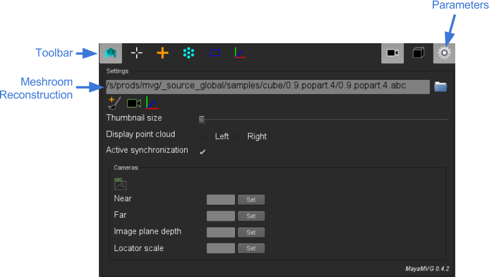

#### **Toolbar**

* : Maya mode

* 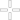: Creation mode (MVG)

* 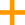 : Triangulation mode (MVG)

*  : Move base on point cloud mode (MVG)

* 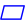 : Move in adjacent plane mode (MVG)

* 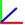 : Locator mode (to reorient scene) (MVG)

* 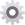 : Open/Close parameters

* 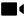 : Show cameras

* 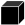 : Show meshes

#### **Parameters**

* 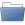 : Load .abc file

* 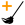 : Delete all 2D data. 

*  : Select closest camera from Maya perspective view. 

*  : Set locator as origin of scene

* **Thumbnail size** : Camera thumbnail size

* **Display point cloud** : Show/hide pointcloud in plugin views.

* **Active synchronisation** : Activate/Deactivate synchronisation on selection (meshes and cameras) between Maya and plugin

* 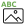 : Remap images paths from alembic project file (if project as been moved for example) 

* **Camera Near & Far** : Set Near/Far Clip Planes for all cameras

* **Camera Locator Scale** : Set camera locator size in viewport.

#### **Viewport**

  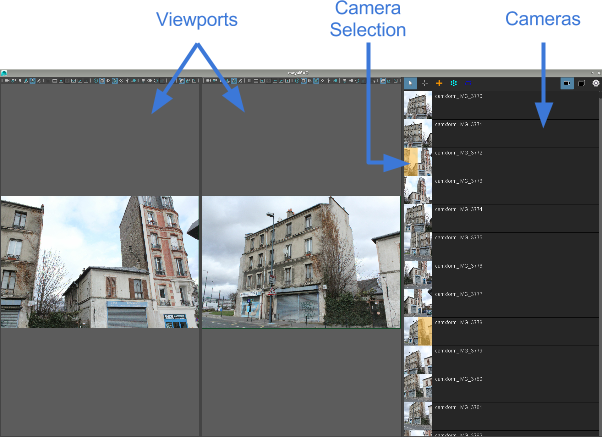

One project is loaded, the different views are displayed below  toolbar and parameters. You can choose which camera you want to display in MayaMVG viewports.

* Mouse wheel : zoom and unzoom in image

* Middle Mouse Button : move in image

### **Modes**

##### **Creation**

*  : New face

Shortcut : CTRL + 0

This tool enables to create a face according to point cloud. You have to create four points.

**Note** : If no plane is detected when you are putting the last point of the face, the polygon will be displayed in red. 

*  : Extend a face

A new face can be create from an existing edge. You have to click the edge and move it.

**Tip** : Pressing **V** key, the new created face will snap to existing edges and points..

##### **Move**

*  : Triangulation

Shortcut : CTRL + 1

This tool enable to set a 3D point more precisely from 2D points clicked on MayaMVG view. It does not use the point cloud at all. You need to set this point in at least two views.

Pressing "Enter"’ key, the 2D positions will be erased.

**Note** : The more views the point is placed in, the more accurate the 3D position will be. The number of views in which the points have been placed is displayed for all points.

**Warning** : Mesh should not have transform value. You have to make a freeze transform if you created it with Maya.

*  : Move base on point cloud

Shortcut : CTRL + 2

Point or edge is moved in a new plane, computed from point cloud.

*  : Move in adjacent plane

Shortcut : CTRL + 3

Point or edge is moved in the plane in which it already is.

##### **Locator**

*  : Create locator by triangulation

This tool enables to set a locator by triangulated its position. You need to place a 2D point on at least two different views. The 3D position will be automatically computed and locator will be created there. 

**Tip** : The more 2D points there is, the more the 3D position will be accurate.

Once the locator created, it can be adjusted with Maya tools (rotation, scale, move, …) Once correctly place, you have to click on the Locator button in parameters () to apply the transformation. 

* Create locator from vertex

Locator can also be created from an existing vertex. You have to set vertex selection mode and select the vertex from which you want to create the locator. Then, in MayaMVG menu, click on "Create locator from vertex".

  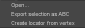

Proceed as in "Create locator by triangulation" section to place it more precisely and click on Locator button in parameters () to apply transformation. 

### **Cameras**

To set a camera in one of the MayaMVG view, click on the corresponding thumbnail.

**Tip** : If you select a camera in Maya, it automatically selects it in MayaMVG and load it in the left viewport.
You can also select the camera directly from MayaMVG.

  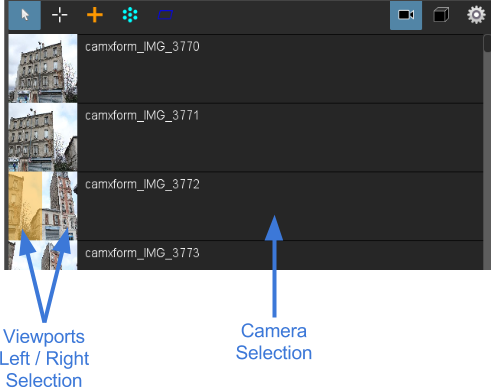

### **Meshes**

To display meshes list, click on icon .

Meshes can be activated/deactivated in plugin.

**Tip** : In order to optimize performance, it’s recommended to deactivate meshes that are not used for modeling. 

### **Alembic bridge**

#### **Export from MayaMVG**

Select meshes and cameras to export.
Click on menu : "MayaMVG > Export selection as ABC" to choose file location. 

#### **Import in Nuke/Mari**

In menu "NukeMVG > Import Alembic" , .abc file can be loaded. The tool create the graph of camera projection. Result can be export to Mari via Nuke<>Mari bridge.

